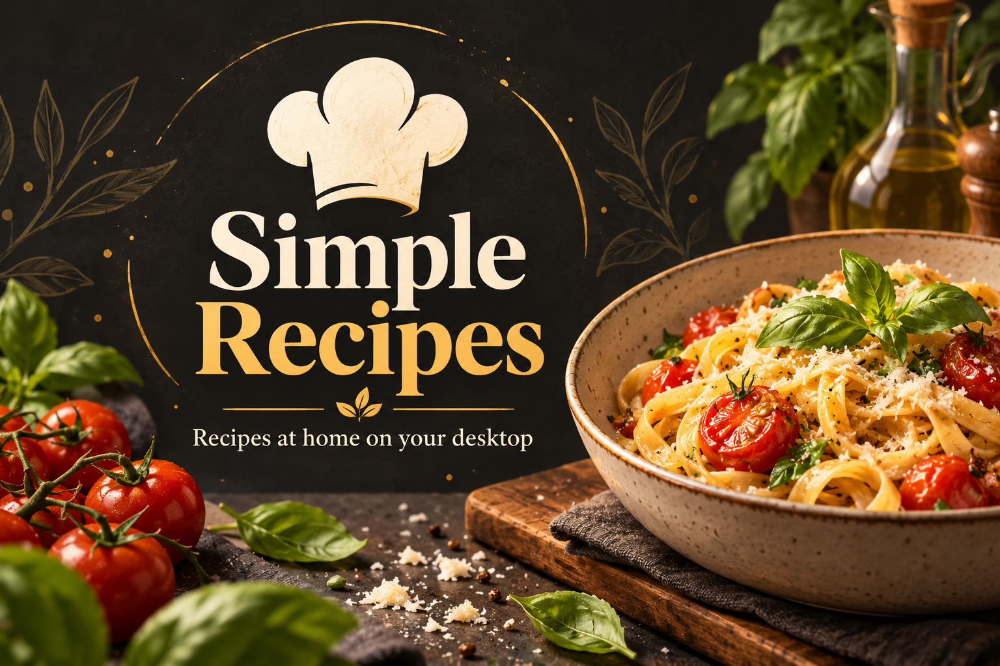

# Simple Recipes



**Your recipe collection, one chef-hat click away.**

Simple Recipes brings recipe importing, a searchable library and a comfortable cooking view to Omarchy. Click the chef hat in your bar to open a native Python window that follows your desktop theme. Recipes live in a local SQLite database, without a browser or database server.

- **Import and translate:** import public recipe pages or YouTube links; optional AI extracts ingredients and preparation steps and translates both into your chosen language.
- **Find something to cook:** search your library, group by category, assign categories, keep favourites and track recipes you have tried.
- **Preview before importing:** two-column YouTube results with thumbnails, video duration, channel filters, 1–50 results and a preferred search language.
- **Cook comfortably:** a focused step-by-step window, adjustable text size and a timer.
- **Use your preferred AI:** a configured local llama.cpp server, Codex with an existing ChatGPT login, or supported online API providers.
- **Keep your recipes:** SQLite backups and recipe-only JSON export/restore; your data stays outside the plugin directory.

## Install

Requires Omarchy Quattro's plugin-capable Quickshell, a graphical Wayland session, `uv`, `python3` and systemd user services. This plugin needs **manual setup** after installation:

```sh
omarchy plugin add https://github.com/uBruckhaus/omarchy-simple-recipes
bash ~/.config/omarchy/plugins/ubruckhaus.simple-recipes/setup.sh
omarchy plugin enable ubruckhaus.simple-recipes
```

The setup script automatically installs Python 3.14 and the pinned Python dependencies into a private runtime, and creates the SQLite database. It creates an on-demand user service; there is no login autostart. By running setup, you also allow it to add a managed floating-window rule to your Hyprland Lua configuration, with a backup before adding its `require` line. Existing unmanaged files are never replaced.

Click the chef hat and complete the first-run assistant. **No AI** works for structured recipe pages and manual recipes. To translate, choose a provider/model in Settings and run the language check. Selecting a model or target enables AI import; you can turn the import checkbox off for an individual untranslated import. Installation does not install an AI engine, download a local model, or configure an online account.

See the [user manual and setup help](USER_GUIDE.md).

## Languages and AI

English, German, French, Italian and Spanish interfaces are built in. A configured model is checked against 21 target languages, including Chinese, Japanese, Hindi, European/Brazilian Portuguese, Swedish, Danish and Norwegian Bokmål. Successfully checked targets are selectable. Additional interface translations can be generated and cached with that model. Selecting an interface language also selects the same recipe target; you may then change the target separately. Measurement conventions follow the interface: English uses US kitchen units; other interfaces use metric units and Celsius.

AI translations depend on source quality and model output. Failed AI imports retain the original text and show a notice; failed reprocessing leaves the saved recipe unchanged. Reprocessing an incomplete imported recipe retrieves its original source to recover missing ingredients or instructions. YouTube search language is a preference, not a strict spoken-language filter.

**Local AI lifecycle:** local mode expects your separately configured `llama-server.service` and a compatible llama.cpp router. The next AI operation starts that service and loads your saved model. Hiding or closing the recipe window stops `llama-server.service` after current work finishes to release GPU memory. Stopping the recipe service also stops it. This affects other apps sharing that AI service. Online providers do not need this local service.

## Data and external services

Recipes and settings are stored at `~/.local/share/simple-recipes/data/rezepte.db`. Python includes SQLite; no separate database package or server is needed. Source imports, video search, previews and sharing contact external services. Online AI sends recipe text to the selected provider and may consume account limits or paid requests. Codex uses its existing login through isolated, ephemeral requests with command tools disabled; the plugin does not read its authentication file.

API keys are stored in the owner-only local database. Complete SQLite backups include credentials; keep them private. Recipe JSON exports exclude credentials. Reset requires confirmation and clears recipes, categories, phone number, keys, preferences and YouTube search. Reset and first-run setup restore search defaults to 10 results and all languages. Reset does not sign you out of Codex.

## Update or remove

```sh
omarchy plugin update ubruckhaus.simple-recipes
bash ~/.config/omarchy/plugins/ubruckhaus.simple-recipes/setup.sh
```

Rerun setup after dependency changes. The database and runtime are outside the plugin directory and survive updates.

To remove the plugin:

```sh
bash ~/.config/omarchy/plugins/ubruckhaus.simple-recipes/scripts/stop.sh
omarchy plugin disable ubruckhaus.simple-recipes
omarchy plugin remove ubruckhaus.simple-recipes
```

For complete configuration cleanup, remove the managed `~/.config/systemd/user/simple-recipes.service`, run `systemctl --user daemon-reload`, remove only the Simple Recipes `require("hypr.simple-recipes")` line from `~/.config/hypr/hyprland.lua`, and remove its managed `~/.config/hypr/simple-recipes.lua` file. Reload Hyprland and check for configuration errors. Keep `~/.local/share/simple-recipes` until you decide to delete your database and private runtime. Back up recipes first.

## Development

The native application starts with `python -m app.native --background` and uses an owner-only Unix socket. It runs no HTTP listener. Legacy web files remain for regression comparisons and are not loaded by the native app.

```sh
uv venv .venv
uv pip install --python .venv/bin/python -r requirements-dev.txt
omarchy plugin validate .
bash -n setup.sh scripts/*.sh
RECIPES_DATA_DIR=/tmp/recipes-test QT_QPA_PLATFORM=offscreen QT_QPA_PLATFORMTHEME= QT_STYLE_OVERRIDE=Fusion .venv/bin/python -m pytest -q
```

Licensed under [MIT](LICENSE). The preview is an original AI-generated illustration, rather than an application screenshot.
